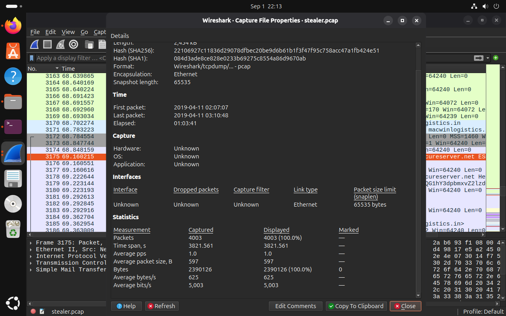
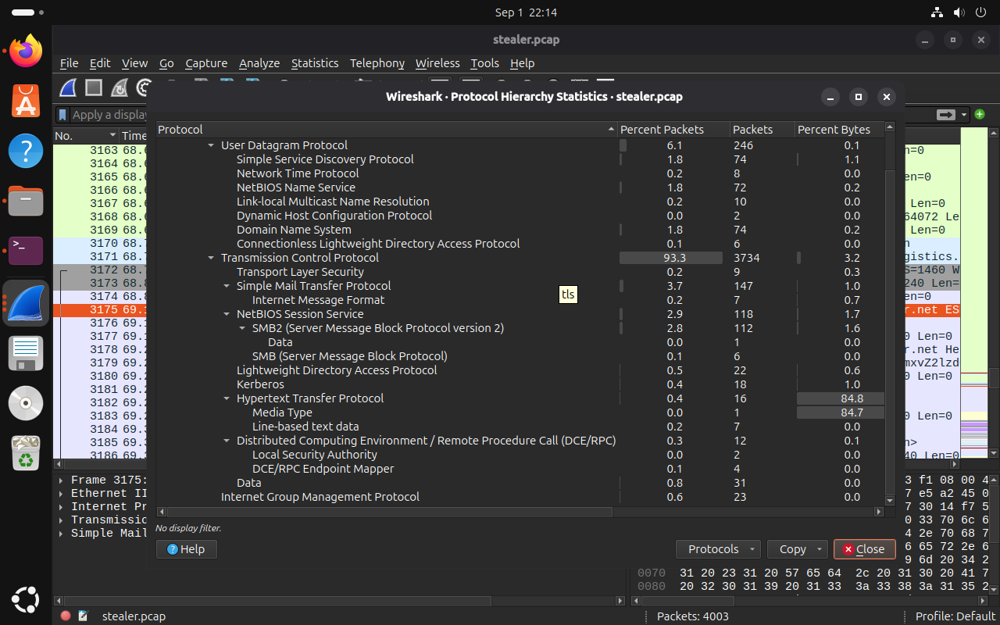
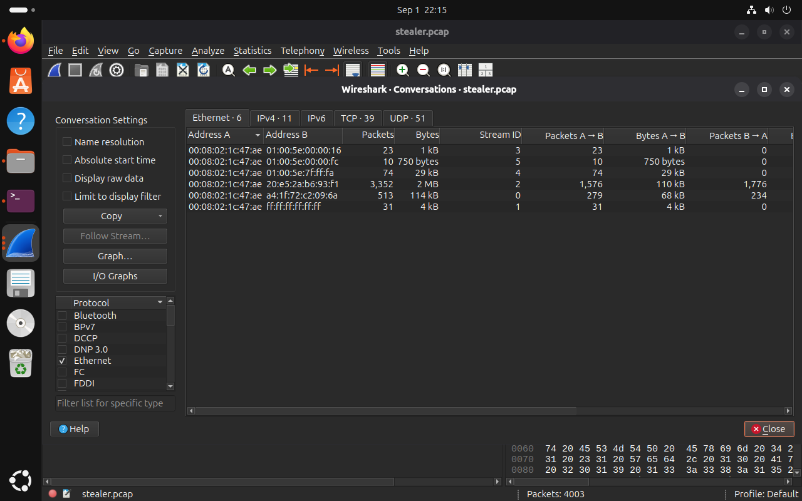

# Day 2 – Initial PCAP Investigation and Documentation

## Objective

To continue the HawkEye Network Forensics lab by analyzing the provided PCAP in Wireshark, understanding the captured network traffic, solving the initial CyberDefenders questions, and documenting the investigation process.

## Activities Performed

Today I continued the HawkEye investigation after completing the initial exploration of the lab scenario.

### 1. PCAP Analysis

I opened the provided `stealer.pcap` capture in Wireshark and examined its overall characteristics.

The Capture File Properties were reviewed to understand:

- Total number of captured packets
- Start and end timestamps
- Capture duration
- Total captured bytes
- Average packet size

### 2. Capture Statistics

The initial capture statistics identified:

| Property | Finding |
|---|---|
| Total Packets | 4003 |
| First Packet | 2019-04-11 02:07:07 |
| Last Packet | 2019-04-11 03:10:48 |
| Capture Duration | 01:03:41 |
| Captured Bytes | 2,390,126 |
| Average Packet Size | 597 bytes |

Evidence:

### 3. Protocol Hierarchy Analysis

I examined the Protocol Hierarchy Statistics in Wireshark to understand the different protocols present in the network capture.

The analysis showed that TCP represented the majority of the traffic. Other protocols observed included UDP, DNS, HTTP, SMTP, SMB/SMB2, TLS and other network protocols.

This helped establish which protocols should be investigated further during the forensic analysis.

Evidence:

### 4. Network Conversations

I examined the Conversations section in Wireshark to understand communication between different hosts.

The Conversations view provided information about:

- Source and destination addresses
- Protocols
- Packet counts
- Data transferred
- Communication direction

This provides a useful starting point for identifying hosts and connections that require deeper investigation.

Evidence:

## CyberDefenders Questions

I also started solving the questions provided in the HawkEye lab using the evidence obtained from Wireshark.

### Q1 – Number of packets

**Answer:** `4003`

The answer was obtained from Wireshark Capture File Properties.

**Status:** Solved

### Q2 – First packet captured (UTC)

The first packet timestamp was observed in Wireshark as:

`2019-04-11 02:07:07`

The question requires the UTC timestamp, so the displayed time and required answer format were investigated before recording the final verified answer.

**Status:** Under verification

### Q3 – Capture duration

**Answer:** `01:03:41`

The answer was obtained from Wireshark Capture File Properties.

**Status:** Solved

## Documentation

During today's work, I also created a structured GitHub repository for documenting the investigation.

The repository contains separate sections for:

- Investigation notes
- Question answers
- Indicators of Compromise
- Attack timeline
- Screenshots
- Tools and references
- Final forensic report

The original PCAP and potentially unsafe artifacts were not uploaded to the repository.

## Tools Used

- VMware
- Ubuntu
- Wireshark
- CyberDefenders

## Learning Outcomes

Today I learned how to perform an initial PCAP investigation using Wireshark and how capture statistics, protocol hierarchy and network conversations can provide useful information during a network-forensics investigation.

I also learned the importance of documenting forensic findings together with the method and supporting evidence instead of recording answers without verification.

## Next Steps

The next stage of the investigation will focus on deeper packet analysis, including:

- Identifying the relevant internal host
- Investigating DNS traffic
- Examining HTTP communication
- Investigating suspicious network connections
- Continuing the CyberDefenders questions
- Updating the IOC and attack timeline as evidence is identified
